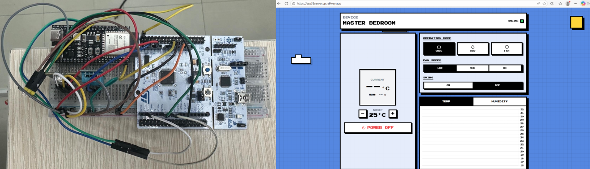
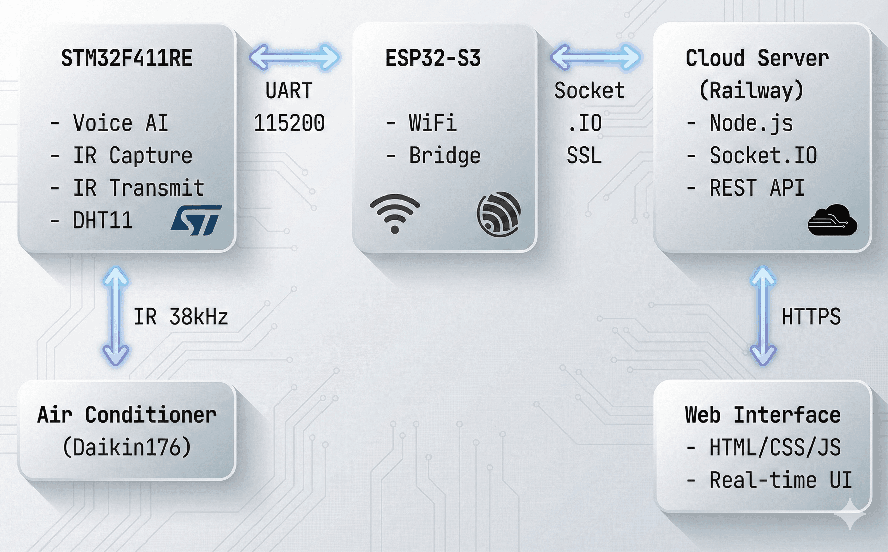
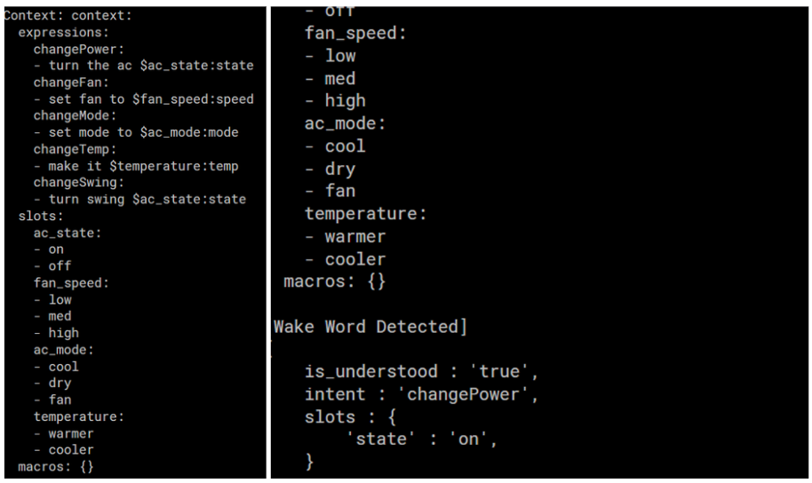
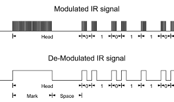
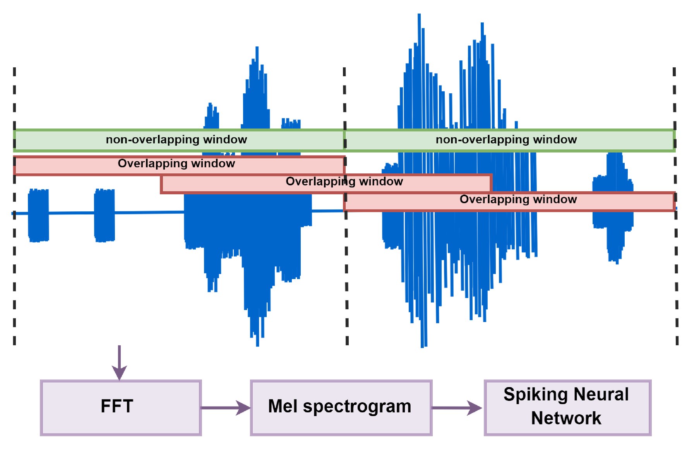
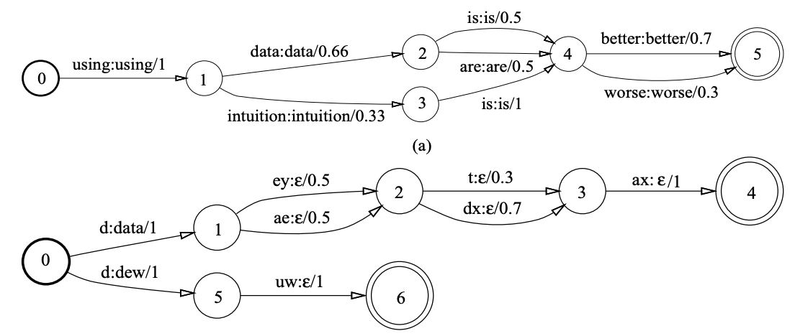
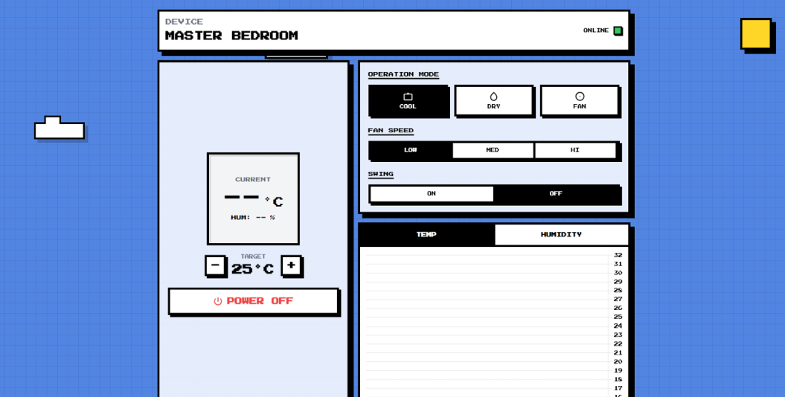

# Smart IR AC Remote & Voice Control System

**Course:** Embedded System Lab (2110366)  
**Semester:** Year 3, Semester 1  
**Institution:** Chulalongkorn University

---

## 👥 Project Members
* Anantawat Tinprapa (6631357021)
* Chayakorn Unhasirikul (6632039621)
* Piyongkul Rardyota (6632134521)
* Rachata Kanitpunyacharoen (6632184921)

---

## 📖 Project Overview

This project implements a **Smart Air Conditioner Controller** using the **STM32 Nucleo-F411RE** microcontroller. It upgrades legacy AC units by adding modern smart features, including **Infrared (IR) signal cloning**, **offline voice commands**, and **web-based remote control**.

The system is engineered to perform complex audio processing and "Edge AI" tasks within strict hardware constraints (**512KB Flash** and **128KB SRAM**). By integrating an **ESP8266** for WiFi, the system also serves as an IoT node, allowing users to monitor room temperature and control the AC remotely via a real-time web dashboard.  

A user saying "a jawn yam" (wake word) followed by "turn the ac on".

### 🛠 Hardware Specifications
* **MCU:** STM32 Nucleo-F411RE (ARM Cortex-M4)
* **Connectivity:** ESP8266 (WiFi Module)
* **Audio Input:** INMP441 (I2S MEMS Microphone)
* **Sensors:** DHT11 (Temperature & Humidity)
* **IR Interface:** IR Transmitter (LED) & IR Receiver module

---

## 🚀 Key Features

### 1. Universal IR Control & Cloning
The system replaces standard AC remotes by capturing, analyzing, and replaying raw IR signals.
* **Signal Capture:** The IR receiver reads the timing and pulse encoding from the original remote.
* **Reverse Engineering:** We decode these signals and hard-code the remote’s protocol into the STM32.
* **Imitation:** We then program the STM32 to send signals that control the AC (power, temperature, fan speed) without the original remote.

### 2. Edge AI Wake-Word Recognition
Optimized specifically for the STM32 architecture, this feature enables hands-free activation.
* **Mel Spectrogram Processing:** Audio input is converted into Mel-frequency cepstral coefficients (MFCCs) to visualize sound features accurately.
* **Incremental Computation:** To achieve real-time performance on limited hardware, the system utilizes a highly optimized sliding window technique. Instead of recomputing the entire buffer, it calculates only the **newly sampled data** entering the window.
* **Efficient Matrix Operations:** This incremental approach is applied to both the spectrogram generation and the AI matrix calculations, significantly reducing CPU cycles.
* **Powered by Picovoice:** Utilizes the Picovoice library for highly efficient computing.

### 3. Voice Command Intent Recognition
Once the wake word is detected, the system processes natural language commands.
* **Command Trees:** Spoken words are parsed into a decision tree structure (e.g., *[Wake Word] -> "Turn" -> "On" -> "The" -> "AC"*).
* **Intent Execution:** The system identifies the user's intent from the sentence structure and triggers the corresponding IR signal.
* **Powered by Picovoice:** Utilizes the Picovoice library for highly efficient computing.
* 

### 4. IoT Web Dashboard & Telemetry
A dedicated web interface provides remote control capabilities and environmental data visualization.
* **Websocket Communication:** The website uses JavaScript and WebSockets to maintain a persistent, low-latency connection with the ESP8266.
* **Real-Time Control:** Commands sent from the website are relayed to the STM32 to trigger IR transmission.
* **Data Reporting:** The system reads the DHT11 sensor and pushes temperature and humidity data to the web dashboard, displaying historical trends on a graph.

---

## 💻 Technologies & Tools

| Category | Stack |
| :--- | :--- |
| **Languages** | C (Firmware), JavaScript (Web Interface) |
| **Communication** | WebSockets, UART, I2C/SPI |
| **AI & Audio** | **Picovoice** (AI Engine), ARM CMSIS-DSP |
| **Hardware** | STM32 Nucleo-F411RE, ESP8266, Arduino |
| **Development** | STM32CubeIDE, VS Code, Arduino IDE, GitHub |

---
